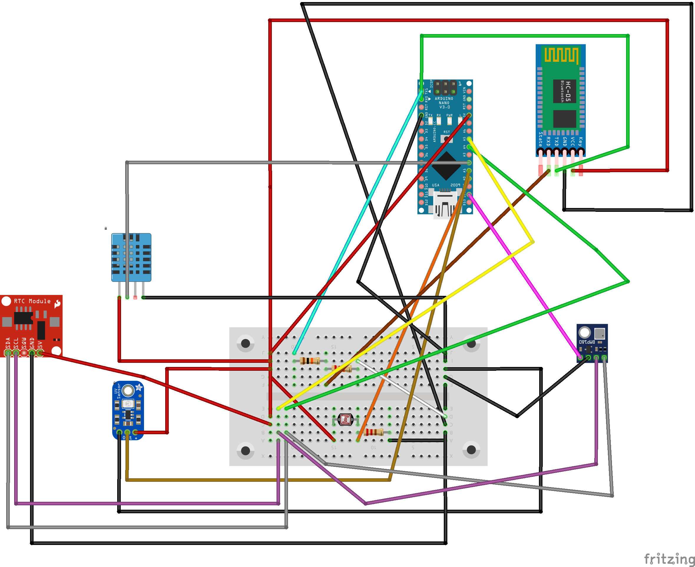

# Localização dos pinos no Arduino NANO

### Alimentação e Comunicação Serial:

  - USB para o Computador

### LDR:

  - Primeira Perna: 5V
  - Depois do resistor na segunda perna do LDR: A0
  - Segunda perna do resistor: GND

### DHT11: 

  - Perna Esquerda(-): GND
  - Perna do Meio: 5V
  - Perna Direita(S): A2

### BMP180: 

  - VIN: 3V3
  - GND: GND
  - SCL: A5
  - SDA: A4

### GUVA-S12SD: 

  - VCC: 5V
  - GND: GND
  - S: A1

### RTC DS1307 ou RTC 3231:
  - VCC = 5V
  - GND = GND
  - SDA = A4
  - SCL = A5

#

  **OBS 1:** Coloca um *resistor ou potenciômetro* na segunda perna do LDR.

  **OBS 2:** Para salvar os dados, precisa conectar a placa no computador e executar o arquivo python.
