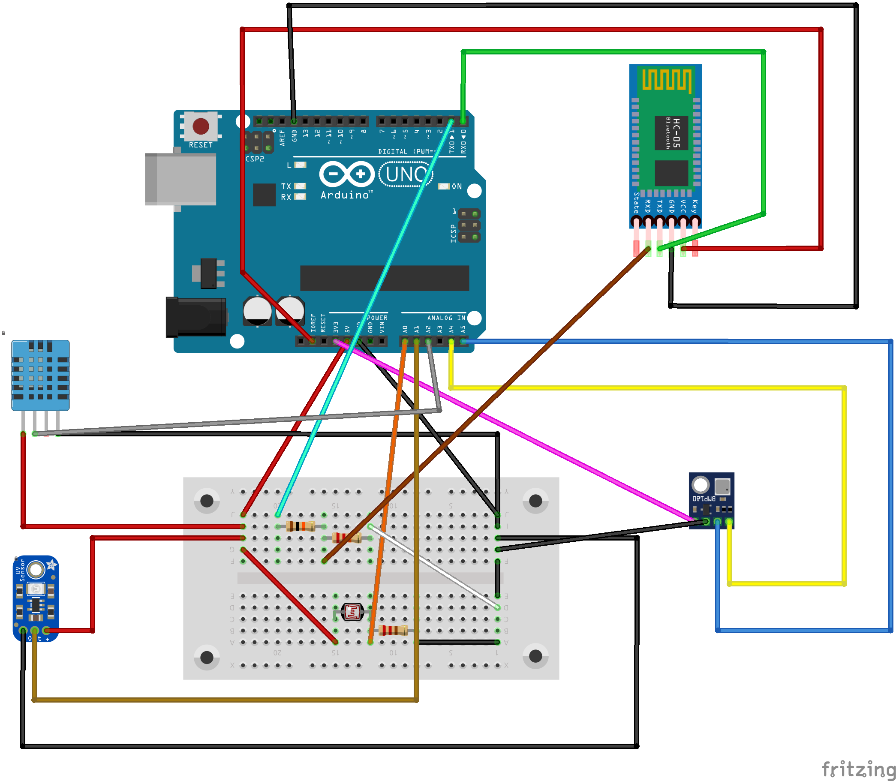

# Localização dos pinos no Arduino UNO

### Alimentação: 

  - Conector ou
  - Alimentação +: VIN
  - Alimentação -: GND

### LDR:

  - Primeira Perna: 5V
  - Depois do resistor na segunda perna do LDR: A0
  - Segunda perna do resistor: GND

### DHT11: 

  - Perna Esquerda(-): GND
  - Perna do Meio: 5V
  - Perna Direita(S): A2

### BMP180: 

  - VIN: 3V3
  - GND: GND
  - SCL: A5
  - SDA: A4

### GUVA-S12SD: 

  - VCC: 5V
  - GND: GND
  - S: A1

### HC-06 ou HC-05:

  - VCC: 5V
  - GND: GND
  - TXD: RX
  - RXD: Depois do Resistor de 10k e do de 20K
  - Primeira Perna Resistor de 10k: TX
  - Segunda Perna Resistor de 20K: GND

#

  **OBS 1:** Coloca um *resistor ou potenciômetro* na segunda perna do LDR.

  **OBS 2:** Para usar o pino **RX** corretamente deve fazer um **divisor de tensão** para não queimar o modulo. Então para isso deve colocar o *fio do arduino em um resistor 10k* e na outra ponta *ligar outro resistor de 20 ou 22k*, no meio deles vai o *fio do sensor* e na outra ponta do de 22k vai um *fio ao GND* da placa.
